---
header:
  image: /images/covers/35471u.jpg
  caption: "**Photo credit**: Erste Ansicht der Stadt Mekka: links im Hintergrund die Festung Djijād. Das grosse Gebäude rechts ist ied [i.e., die] Hamīdijjah, links daneben die Druckerei. *Library of Congress*, [LC-DIG-ppmsca-35471](http://hdl.loc.gov/loc.pnp/ppmsca.35471)"
title:			'Chronological Coverage of an Arabic Corpus'
subtitle:		'An Experiment with Date Statements'
author_profile:		true
layout:		single
comments: true
categories:
  - Coding
  - Corpora
  - Methods
  - Historical Texts
tags:
  - Blogpost
  - Chronology
---

> *While looking for a way to identify all biographical collections and chronicles (and, by extension, all other texts that offer data for time-series analysis) in a collection of 0ver 10,000 texts, it occurred to me that all these texts share the same common feature—they are teeming with dates. So, what if we try to identify such texts computationally?! Not only will this help us to find all relevant titles in the sea of text—without overlooking or missing anything!—we, arguably, can get an insight into the chronological coverage of each of those titles, the chronological focus of individual historians, the chronological coverage of the entire collection of historical texts, and identify texts that focus on particular periods. The blogpost begins with an overview of several digital collections and then explains the methodology of the experiment. Appendices offer one to explore the chronological coverage of about 1,000 individual texts as well as the coverage of particular periods (here,* hijri *centuries—i.e., which texts focus on particular periods).*

*****************

# Introduction

Digital collections of classical Arabic texts have mushroomed over the past decade and a half. The three major libraries—_al-Ǧāmiʿ al-kabīr_ (HDD), [Shamela.ws](http://shamela.ws/), [ShiaOnlineLibrary.com](http://shiaonlinelibrary.com/)—include over 10,000 titles. There is probably another dozen collections that offer texts in hundreds and thousands (for example, [Alwaraq.net](alwaraq.net), [Waqfeya.com](waqfeya.com), [NoorLib.ir](noorlib.ir), [GhBook.ir](http://www.ghbook.ir), [Lib.Eshia.ir](http://lib.eshia.ir/), [Library.Tebyan.net](http://library.tebyan.net/), [HathiTrust.org](hathitrust.org), [Archive.org](http://www.archive.org)).

<svg width="750" height="384"><g class="venn-area venn-circle venn-sets-A"><path d="
M 346.48597001051166 100.79015857580998 
m -85.79015857580997 0 
a 85.79015857580997 85.79015857580997 0 1 0 171.58031715161994 0 
a 85.79015857580997 85.79015857580997 0 1 0 -171.58031715161994 0" style="fill-opacity: 0.25; fill: rgb(31, 119, 180);"></path><text text-anchor="left" dy=".35em" x="350" y="100" style="fill: rgb(31, 119, 180)"><tspan x="350" y="100" dy="0.35em">ShiaOnlineLibrary.com</tspan></text></g><g class="venn-area venn-circle venn-sets-B"><path d="
M 203.90825723824236 212.81561417543597 
m -156.18438582456403 0 
a 156.18438582456403 156.18438582456403 0 1 0 312.36877164912806 0 
a 156.18438582456403 156.18438582456403 0 1 0 -312.36877164912806 0" style="fill-opacity: 0.25; fill: rgb(255, 127, 14);"></path><text text-anchor="middle" dy=".35em" x="120" y="212" style="fill: rgb(255, 127, 14);" ><tspan x="120" y="212" dy="0.35em">Shamela.ws</tspan></text></g><g class="venn-area venn-circle venn-sets-C"><path d="
M 291.1311740012473 212.81561417543597 
m -98.04420271925282 0 
a 98.04420271925282 98.04420271925282 0 1 0 196.08840543850565 0 
a 98.04420271925282 98.04420271925282 0 1 0 -196.08840543850565 0" style="fill-opacity: 0.25; fill: rgb(44, 160, 44);"></path><text text-anchor="middle" dy=".35em" x="373" y="228" style="fill: rgb(44, 160, 44);" ><tspan x="373" y="210" dy="0.35em">al-Ǧāmiʿ al-kabīr</tspan></text></g><g class="venn-area venn-intersection venn-sets-A_B"><path d="
M 266.51627810002987 69.72893380592618 
A 156.18438582456403 156.18438582456403 0 0 1 357.74513727230175 185.8382770795938 
A 85.79015857580997 85.79015857580997 0 0 1 266.51627810002987 69.72893380592618" style="fill-opacity: 0;"></path><text text-anchor="middle" dy=".35em" x="279" y="97" style="fill: rgb(200, 0, 0);" font-size="20"><tspan x="279" y="97" dy="0.35em"></tspan>118</text></g><g class="venn-area venn-intersection venn-sets-A_C"><path d="
M 262.6505247971073 118.99920672042488 
A 98.04420271925282 98.04420271925282 0 0 1 382.9530220440803 178.4439120230428 
A 85.79015857580997 85.79015857580997 0 0 1 262.6505247971073 118.99920672042488" style="fill-opacity: 0;"></path><text text-anchor="middle" dy=".35em" x="366" y="171" style="fill: rgb(200, 0, 0);" font-size="20"><tspan x="366" y="171" dy="0.35em"></tspan>50</text></g><g class="venn-area venn-intersection venn-sets-B_C"><path d="
M 332.2502958221003 301.8205775625179 
A 98.04420271925282 98.04420271925282 0 1 1 332.2502958221003 123.81065078835405 
A 156.18438582456403 156.18438582456403 0 0 1 332.2502958221003 301.8205775625179" style="fill-opacity: 0;"></path><text text-anchor="middle" dy=".35em" x="278" y="239" style="fill: rgb(200, 0, 0);" font-size="20"><tspan x="278" y="239" dy="0.35em"></tspan>1,689</text></g><g class="venn-area venn-intersection venn-sets-A_B_C"><path d="
M 262.6505247971073 118.99920672042488 
A 98.04420271925282 98.04420271925282 0 0 1 332.2502958221003 123.81065078835405 
A 156.18438582456403 156.18438582456403 0 0 1 357.74513727230175 185.8382770795938 
A 85.79015857580997 85.79015857580997 0 0 1 262.6505247971073 118.99920672042488" style="fill-opacity: 0;"></path><text text-anchor="middle" dy=".35em" x="313" y="147" style="fill: rgb(200, 0, 0);" font-size="20"><tspan x="313" y="147" dy="0.35em"></tspan>365</text></g>

<g class="venn-area venn-intersection venn-sets-A_B_C"><text text-anchor="left" dy=".35em" x="400" y="280" style="fill: rgb(0, 0, 0);" font-size="20"><tspan x="380" y="300" dy="0.35em"></tspan>ShiaOnlineLibrary.com: 1,810 titles</text></g>

<g class="venn-area venn-intersection venn-sets-A_B_C"><text text-anchor="right" dy=".35em" x="400" y="305" style="fill: rgb(0, 0, 0);" font-size="20"><tspan x="400" y="325" dy="0.35em"></tspan>Shamela.ws: 5,999 titles</text></g>

<g class="venn-area venn-intersection venn-sets-A_B_C"><text text-anchor="right" dy=".35em" x="400" y="330" style="fill: rgb(0, 0, 0);" font-size="20"><tspan x="400" y="350" dy="0.35em"></tspan>al-Ǧāmiʿ al-kabīr: 2,364 titles</text></g>

<g class="venn-area venn-intersection venn-sets-A_B_C"><text text-anchor="right" dy=".35em" x="380" y="360" style="fill: rgb(50, 0, 0);" font-size="24"><tspan x="380" y="375" dy="0.35em"></tspan>UNIQUE: 7,895 titles (~1,1 billion words)</text></g>
</svg>

<figcaption>
<b>Overlap among collections.</b> There is significant overlap among available digital collections. Thus, while their cumulative volume may run into tens of thousands, the count of unique titles—excluding the exact copies and texts based on different editions—is significantly lower. Additionally, it is very difficult to identify duplicates among the collections. The Venn diagram above shows the overlap—over 2,000 titles—among the three major collections (the count it still work in progress). <b>NB</b> The diagram generated with <a href="https://github.com/benfred/venn.js/">Ben Frederickson’s</a> code.
</figcaption>

The number of these collections appears to be growing and their content expanding. This new research environment offers scholars an opportunity to check whether a particular text is included into in a certain collection, to browse and read it—often in a page-by-page manner—and to search for particular bits of information. These collections work well for looking for something that we know or expect to find—a book, a person, an event, a term. What we cannot do is to look into how books are related, how they overlap and complement each other; how each individual fits among his contemporaries as well as his predecessors and successors; how different historical events are intertwined; how terms, notions and concepts are related to each other and evolve across time and space. Yet, having full texts of our sources at our disposal, we can definitely go beyond simplistic linear searches. By asking a series of interconnected questions—and relying on digital methods of text analysis—we can move toward a new understanding of the entire Arabic written tradition (starting, of course, with what is digitally available in one form or another).

The question of chronology is one of such foundational questions. What I offer in this experiment is to explore the content of three such collections in order to understand better the chronological coverage of each collection, each author, and each book. In order to get insights into these issues we can turn to different kinds of data. To get a perspective on the scope of each collection we shall start with looking into descriptions of books and their authors. More specifically—into when authors died.

# Metadata

While metadata in most collections is not complete, it can still be quite useful. Major digital collections—_al-Ǧāmiʿ al-kabīr_ (HDD), [Shamela.ws](http://shamela.ws/), and [ShiaOnlineLibrary.com](http://shiaonlinelibrary.com/)—display the same clear trend: strong emphasis on the period from the 3rd–6th centuries AH (912–1203 CE), with an extra peak in the 8th century (1300–1397 CE), a steady decline during the 9th–12th centuries AH (1494–1785 CE), a slow recovery during the 13th century AH (1785–1882 CE), and skyrocketing in the 14th century AH (1882–1979 CE).

> **Note on graphs.** Data points of each graphed line show frequencies for periods of time that end at that point. For example, on the graph below that shows distribution of data by 100 lunar years (titles in _al-Ǧāmiʿ al-kabīr_), the value for 300/912 CE is 280, which means that there are 280 titles written by authors who died during 200–300 AH / 815–912 CE. A [“step-before” type of graph](../images/chrono/step_before_example.png) displays such data most appropriately, but it is not suitable for comparative graphs, since there is too much overlap among the lines which makes the entire graph unreadable. Data on the most recent authors (after 1400/1979 CE) is excluded from the graphs, since it tends to overshadow earlier periods.

<figure class="fit">
<a href="../images/chrono/colcov_jk.png">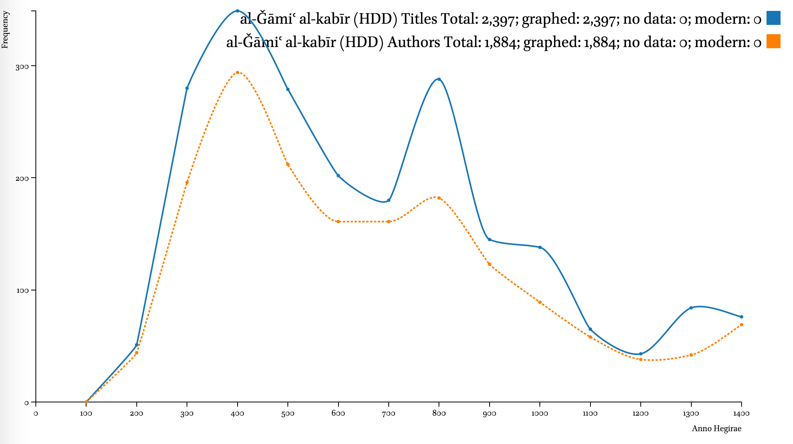</a>
<figcaption class="short">
<b><i>al-Ǧāmiʿ al-kabīr</i> (HDD)</b> has the most complete chronological metadata on its authors.
</figcaption>

<a href="../images/chrono/colcov_sha.png">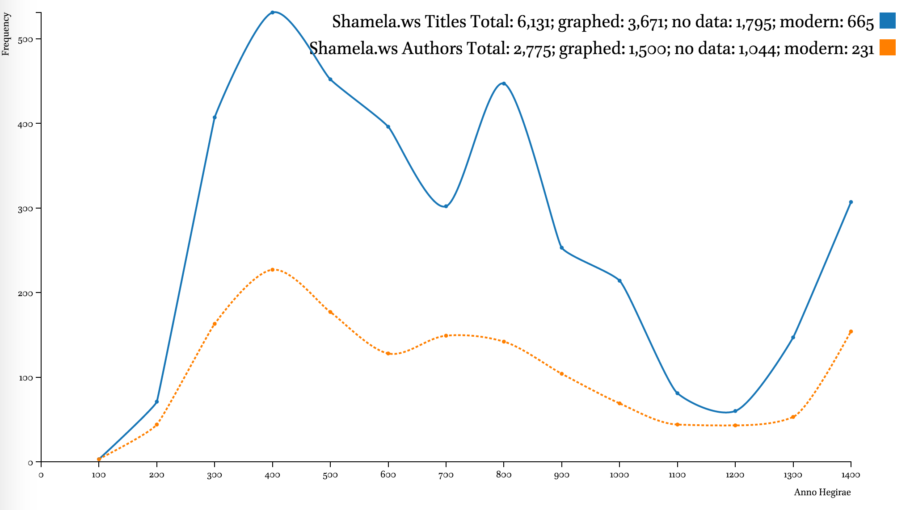</a>
<figcaption class="short">
<b><i>Shamela.ws</i> (online)</b>. Almost half of its metadata do not have chronological metadata.
</figcaption>

<a href="../images/chrono/colcov_shi.png">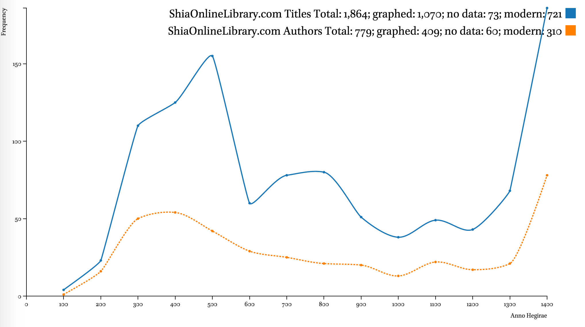</a>
<figcaption class="short">
<b><i>ShiaOnlineLibrary.com</i> (online)</b>. The collection has a rather complete chronological metadata. Almost 1/3 of all titles are books of modern Šīʿīte scholars (excluded from the graph so that they do not overshadow earlier periods).
</figcaption>

<a href="../images/chrono/colcov_alwaraq.png">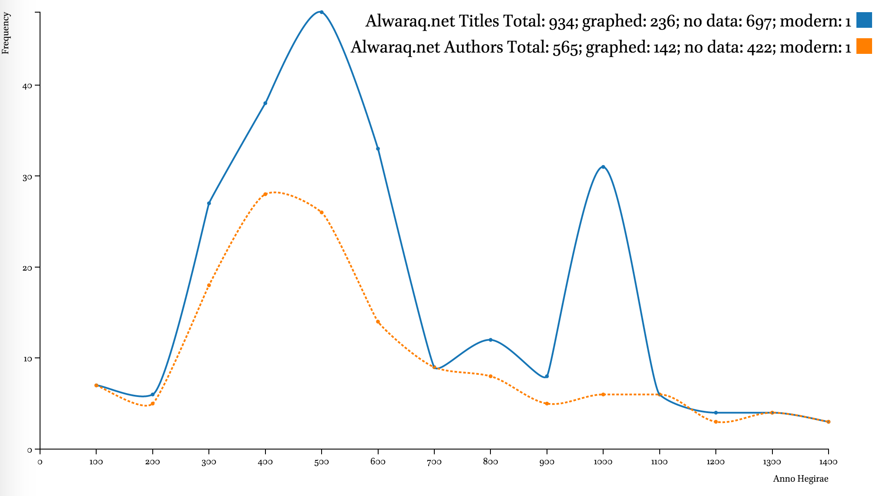</a>
<figcaption class="short">
<b><i>Alwaraq.com</i> (online)</b> has the most incomplete metadata, but it still suggests the same trend.
</figcaption>
</figure>

The developers of these collections were most interested in the early Islamic period (roughly the first half of the first Islamic millennium). According to the data of such sources as the _Hadiyyaŧ al-ʿārifīn_ by Ismāʿīl Bāšā al-Baġdādī (d. 1338/1919 CE), a bibliographical collection that builds upon the famous _Kašf al-ẓunūn_ of Ḥāǧī Ḫalīfaŧ (d. 1067/1656 CE), and _Ḫizānaŧ al-turāṯ_, a Saudi catalog of manuscripts (al-Riyāḍ: Šarikaŧ al-ʿArīs lil-Kumbiyūtir, 2007), the number of contributors to the Islamic written treasury is continuously growing at least up until the beginning of the 13th century AH.

<figure>
<a href="../images/chrono/colcov_ha_kh_authors.png">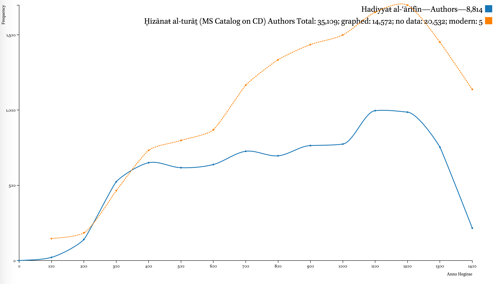</a>
<figcaption>
<b>The “growth” of authors</b>, according to the data from the <i>Hadiyyaŧ al-ʿārifīn</i> and the <i>Ḫizānaŧ al-turāṯ</i>.
  
<b><i>Ḫizānaŧ al-turāṯ</i></b> is a Saudi catalog of manuscripts that was first published on a CD (al-Riyāḍ: Šarikaŧ al-ʿArīs lil-Kumbiyūtir, 2007); currently its full text is included into Shamela.ws. The catalog includes over 160,000 records, but unfortunately suffers from a number of problems, such as inconsistency of typing conventions, duplicate records, selective coverage of different manuscript collections (for example, only about 1,000 Arabic manuscripts from St.Petersburg, Russia are covered, while St.Petersburg academic institutions house at least 11,000 Arabic manuscripts).
</figcaption>
</figure>

Even though existing digital collections often awe us by their volume, the comparative graphs below shows that they cover only a fraction of the Arabic written tradition—even by comparison with an early 20th-century bibliography, which itself is hardly complete in its coverage. Additionally, the graphs also clearly highlights the fact that the chronological coverage of these collections is skewed heavily in favor of the earlier period of Islamic history.

<figure>
<a href="../images/chrono/cov4authors.png">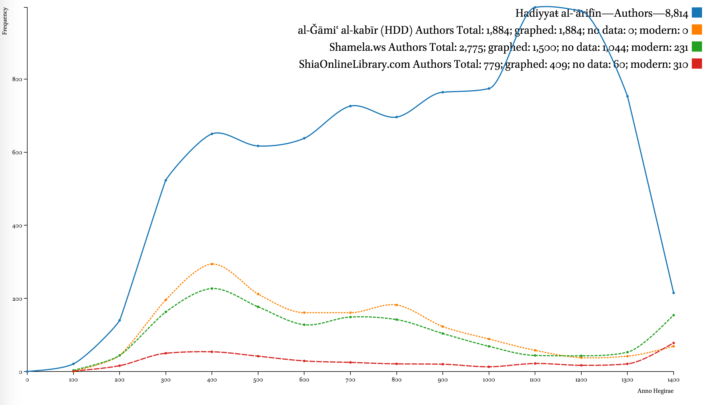</a>

<figcaption>
<strong>Chronological distribution of book titles</strong> in the <i>Hadiyyaŧ al-ʿārifīn</i>, <a href="http://shamela.ws">Shamela.ws</a>, <i>al-Ǧāmiʿ al-kabīr</i> (HDD), and <a href="http://shiaOnlineLibrary.com">ShiaOnlineLibrary.com</a>.
</figcaption>

<a href="../images/chrono/cov4titles.png">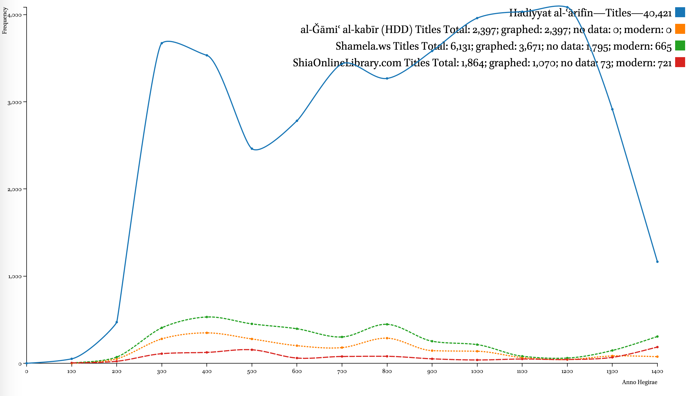</a>

<figcaption>
<strong>Chronological distribution of book titles</strong> in the <i>Hadiyyaŧ al-ʿārifīn</i>, <a href="http://shamela.ws">Shamela.ws</a>, <i>al-Ǧāmiʿ al-kabīr</i> (HDD), and <a href="http://shiaOnlineLibrary.com">ShiaOnlineLibrary.com</a>.
  

<strong>A note on the <em>Hadiyyaŧ al-ʿārifīn</em></strong>. The decline of both graphs after 1200/1785 CE indicates unavailability of bibliographical information to the author more than anything else. The geographical coverage of the collection starts shrinking roughly at the same period. It should be noted that most chronological datasets exhibit a similar trend. For example, the trend can be observed in al-Ḏahabī’s own <i>Ḏayl</i> to his <i>Taʾrīḫ al-islām</i>, where the number of biographies drops dramatically; one can equally see the same trend in Brill’s <i>Index Islamicus</i> and <a href="http://library.harvard.edu/open-metadata">Harvard Open Metadata (on 12 million books)</a>. The only difference is that the lag gets shorter as we get closer to our time—for premodern Arabic sources this lag is 100 to 150 years; in modern datasets—10 to 20 years.
</figcaption>
</figure>

Another way to evaluate chronological coverage is too explore the actual texts. Ideally, the number of discrete units of information—such as, for example, biographies and events—by periods should show the distribution of chronological emphasis of a particular source. Furthermore, the summary of such data from all [available] titles written by a specific author should indicate this author’s interest in specific periods. (The interpretation of such “interest” is a different subject altogether. For example, the fact that the <i>Hadiyyaŧ al-ʿārifīn</i> has more information on the 11th and the 12th centuries AH (1591–1785 CE), may indicate either Ismāʿīl Bāšā al-Baġdādī’s interest in this particular period, or the availability of information for this period, or the genuine growth in numbers of people contributing to the Islamic written treasury.) 

# Date Statements

Almost none of the texts, however, are tagged in a manner that would allow to do such a detailed evaluation. Yet, it is possible to analyze date statements in each texts and offer an evaluation of their chronological coverage based on the frequencies of references to different periods. The consistency of date statements in Arabic texts—essentially, a word for “year” (_ʿām_ or _sanaŧ_) followed by either digits or spelled-out numbers—makes it possible to represent this pattern with a *regular expression*, a special text string for describing a search pattern (see **Figure** below). This *regular expression* can be worked into a script, with which one can check available texts. It should be noted, of course, that this approach is tuned to analyze _hiǧrī_ dates, since other dating systems are used only infrequently.

> **Words _sanaŧ_ and _ʿām_ in the histories of Islam**. Overall, the word <i>sanaŧ</i> is used most frequently in date statements: of about 1,362,000 date statements from across 10,000 texts only 2.9% of statements start with the word <i>ʿām</i> (~40,000), while 97.1% begin with the word <i>sanaŧ</i> (~1,322,000). Closer look also reveals that the word <i>ʿām</i> is favored in texts written in the 20th century; with regards to premodern texts, it can be said that authors from the western part of the Islamic world—al-Andalus and al-Maġrib—tend to use it more frequently, than their eastern counterparts.

> &emsp;**Note:** Adding <i>fī</i> “in,” into the mix changes the picture into: of about 1,670,000 statements, 79.2% start with <i>sanaŧ</i> (~1,322,000), 18.5% with <i>fī</i> (~308,000), and 2.4% with <i>ʿām</i> (~40,000). The problem is that even a quick look at the ngrams of <i>fī</i>-statements—the words that immediately follow each <i>fī</i>-statement—shows that more than a half of these statements are quantitative phrase of different kind (for example, <i>fī arbaʿ mujalladāt</i>). For this reason, <i>fī</i>-statements are excluded from the analysis.

<figure class="fit">
  <a href="../files/year_Statement_re.html" title="">
  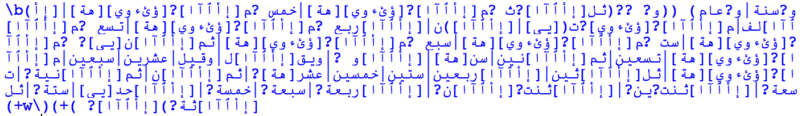
  </a>
  <a href="../images/chrono/years_in_editpadpro.png" title="">
  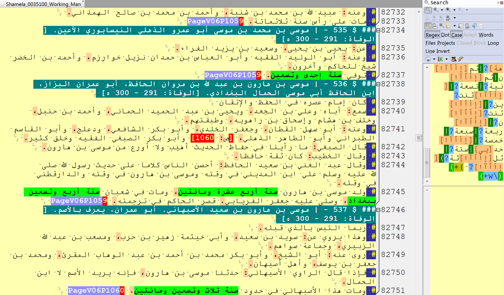
  </a>
    <figcaption>
      [<b>Top</b>] A <i>regular expression</i> for capturing year statements in premodern Arabic sources. You can copy it and test it on some text. [<b>Bottom</b>] The image demonstrates this <i>regular expression</i> highlighting year statements (bright green) in the <i>Taʾrīḫ al-islām</i> of al-Ḏahabī (d. 748/1347 CE). Program used: <i>EditPad Pro</i>.
  </figcaption>
</figure>

Such an approach is not without its problems, of course, but it may serve well as an exploratory technique. The results of the experiment are intriguing in a number of ways, even though not entirely consistent. The most important outcome is that it allowed to discover that the collection of 10,000 texts contains only about 785 texts with more than 100 date statements per text (and since the included collections overlap, the number of unique titles is even smaller). Needless to say, that working with 785 texts is significantly easier than working with 10,000 titles. Additionally, frequencies of date statements for each text offer an opportunity to focus one’s efforts on texts that contain most data suitable for time-series analysis.

<figure class="fit">
  <a href="../images/chrono/ha_compCov.png" title="">
  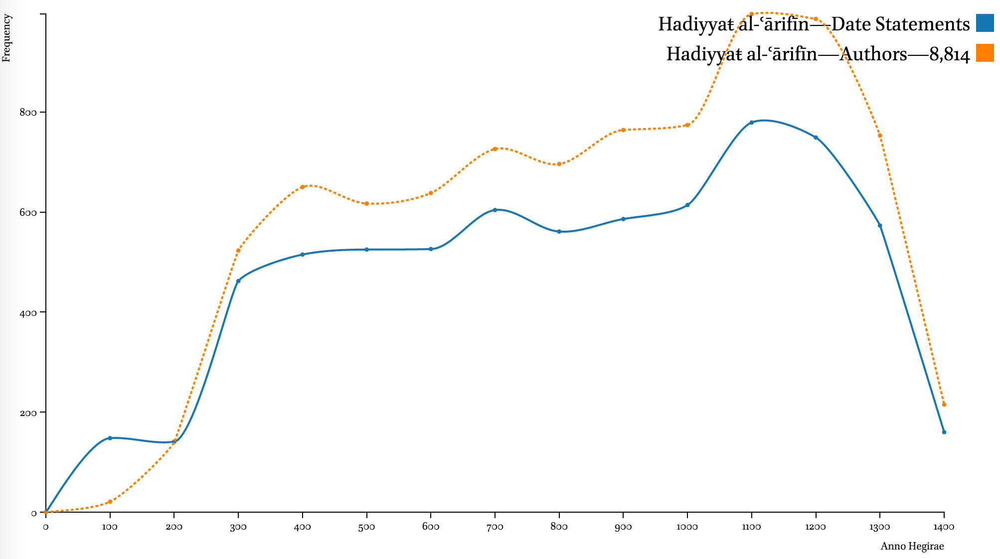
  </a>
    <figcaption>
    <b>Choronolgical coverage.</b> The graphs show the chronological coverage for the same text generated with two different approaches: while the orange dotted line represents the ideal situation—data collected through the manual tagging of the entire source, the blue solid line represents the only realistic situation—data extracted computationally. While the absolute results differ, the relative distribution is very similar and emphasizes the same periods. On the problem of the 1st century AH (622–718 CE) see below.
  </figcaption>
</figure>

The graph above shows two different representations of the chronological coverage of the <i>Hadiyyaŧ al-ʿārifīn</i> by Ismāʿīl Bāšā al-Baġdādī (d. 1338/1919 CE), a bibliographical collection that builds upon the famous <i>Kašf al-ẓunūn</i> of Ḥāǧī Ḫalīfaŧ (d. 1067/1656 CE). The blue line shows the frequencies of date statements by periods (binned into 50 year periods)—strongly suggesting more emphasis on the 11th an 12th centuries AH (1591–1785 CE). The orange dotted line shows the distribution of biobibliographical records on about 8,800 authors—this actual distribution of discrete information units in the source emphasizes the same period of the 11th and 12th centuries. The similarity in the patterns of distribution shows that reliance on computationally extracted date statements is a viable alternative.  

## The 1st Century Problem

 Unfortunately, many texts suffer from what can be characterized as “the 1st century problem”: authors often drop hundreds from date statements (authors from the second millennium also tend to drop thousands), which leads to a very high number of date statements referring—at the face value—to the 1 st century AH (622–718 CE). As a result, the 1st century often gets inflated, overshadowing other periods. The graph below illustrates this issue.

<figure class="fit">
<!-- {{ site.url }} :: .. -->
<a href="../images/chrono/duLamic_A.png" title="">
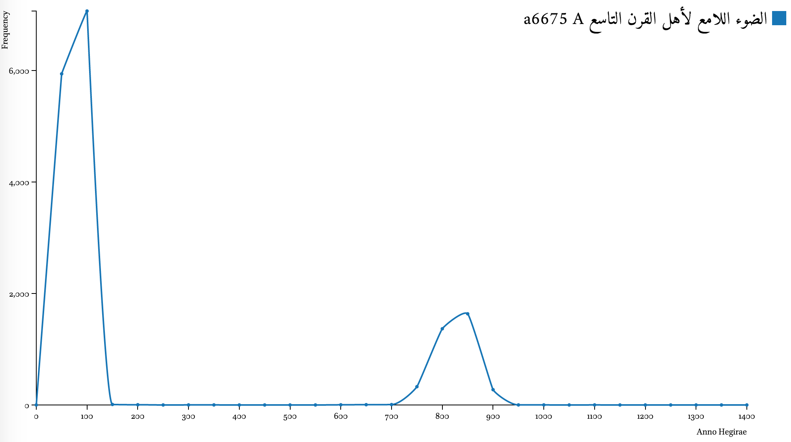
</a>
 <figcaption>
      Since authors often drop hundreds from their date statements, the 1st century AH gets overinflated. As the title suggests, al-Saḫāwī’s (d. 902/1496 CE) <i>al-Ḍawʾ al-lāmiʿ li-ahl al-ḳarn al-tāsiʿ</i> focuses on the 9th century AH (1397–1494 CE), but—as the graph above shows—the number of date statements referring to the 8th (1300–1397 CE) and 9th (1397–1494 CE) centuries is significantly smaller than of those referring to the 1st century (notice the gap in between!). It is clear that al-Saḫāwī is dropping hundreds from his date statements. The problem is that some of those statements may refer to the 8th century, while some others to the 9th, so moving them all to the 9th century is hardly a solution.
  </figcaption>
</figure>

<!--
The same pattern is even more clear in some sources that deal with the second millenium, as we can see in _Ḫulāṣaŧ al-aṯar fī aʿyān al-ḳarn al-ḥādī ʿašar_ of al-Muḥibbī (d. 1111 AH) [**Top right**], _Silk al-durar fī aʿyān al-ḳarn al-ṯānī ʿašar_ of al-Murādī (d. 1206 AH) [**Bottom left**], and _Ḥilyaŧ al-bašar fī taʾrīḫ al-ḳarn al-ṯāliṯ ʿašar_ of al-Bayṭār (d. 1337 AH) [**Bottom right**], where authors drop thousands from date statements. These texts, however, are not the most problematic, since the scope declared in their titles hints to what period incomplete dates are likely to belong to. It is clear that dates for the 2nd and 3rd centuries actually refer to the 12th and the 13th centirues respectively; “the 1st century” date statements, unfortunately, may refer to any century within the scope of a particular title. 
-->

The problem may be resolved through the sequential analysis of date statements in texts. Authors are not likely to drop hundreds from their statements without letting their readers know what century they are talking about. In other words, an incomplete date statement must be preceded by a complete one. Thus, one can check if there are other date statements—and if there is, the incomplete date can be fit into the period of the preceding statement.

The actual implemented algorithm grabs a 100-word chunk before a 1st-century date statement and checks if there are other date statements in that chunk. The procedure is repeated up to five times, that is checking up to 500 words—an equivalent of 1 to 3 printed pages—before the date statement in question, until either the text limit is reached or a date statement found. If a date statement is found, its century gets applied to the starting date statement that we treated as incomplete. In other words, if we start with “the year 65”, and we find “the year 530” preceding it, we change the first date into “the year 565” (1169 CE). If the preceding date is also from the 1st century, the starting date remains unchanged; the date also remains unchanged, if no other date statements have been found. Additionally, the algorithm runs in two different ways—in the first case, it does not build on updated date statements (Lines B); while in the second, it does, extrapolating from corrected date statements (Line C). The graph below shows the results.

<figure class="fit">
<!-- {{ site.url }} :: .. -->
<a href="../images/chrono/duLamic_ABC.png" title="">
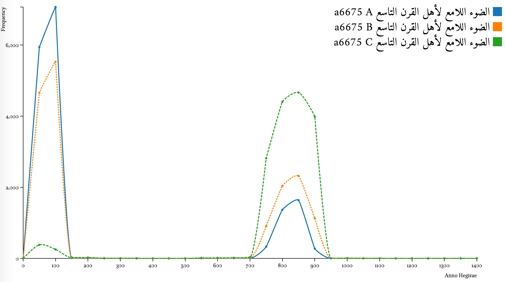
</a>
 <figcaption>
      The graph shows new results for al-Saḫāwī’s (d. 902/1496 CE) <i>al-Ḍawʾ al-lāmiʿ li-ahl al-ḳarn al-tāsiʿ</i>: <b>A</b> (<i>solid blue line</i>) shows unmodified date statements (as in the previous graph); <b>B</b> (<i>dotted orange line</i>) shows the results of the first run of the algorithm—over 2,800 statements were updated, but there is still a lot of dates for the 1st century; <b>C</b> (<i>dashed green line</i>) shows the results of the second run of the algorithm, which builds on the updated dates—almost 12,000 date statements were redistributed, now clearly showing that the book is about 9th century. 
      &emsp;<b>Note:</b> a6675 is the identifier of a particular version of the text—title #6675 from <i>al-Maktabaŧ al-Š<b>ā</b>milaŧ</i>; the same title from a different collection will have a different identifier.
</figcaption>
</figure>

The question is, of course, how reliable such projections are. In order to check this we need to compare algorithmically produced results with manually disambiguated data. The graphs below show such comparisons for four different sources: **A** (**orange dotted**) shows the initial results of computational date statements collection; **B** (**green dashed**)—modified dates without extrapolation; **C** (**red dashed**)—modified results with extrapolation; and, finally, **D** (**blue solid**)—shows manually disambiguated 1st-century date statements.

### _al-Wafayāt al-aʿyān_ of Ibn Ḫallikān (d. 681/1282 CE)
<figure class="fit">
<!-- {{ site.url }} :: .. -->
<a href="../images/chrono/manual_wafayatABCD.png" title="">
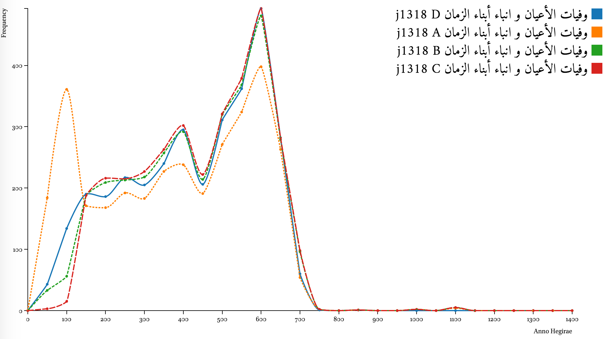
</a>
</figure>
Results for Ibn Ḫallikān’s _al-Wafayāt al-aʿyān_ are very good—algorithmically modified dates are very close to manually disambiguated. Results of Algorithm B—modified results without  extrapolation—are slightly closer to the benchmark (line D) than the results of Algorithm C. Yet, both are somewhat “overfitting” 1st-century dates. Good news: algorithmic lines B and C lead to the same conclusion as the benchmark Line D—Ibn Ḫallikān covers the period of 450–650 AH / 1058–1252 CE most thoroughly.

### _al-Kāmil fī-l-taʾrīḫ_ of Ibn Aṯīr (d. 630/1232 CE)
<figure class="fit">
<!-- {{ site.url }} :: .. -->
<a href="../images/chrono/manual_kamilABCD.png" title="">
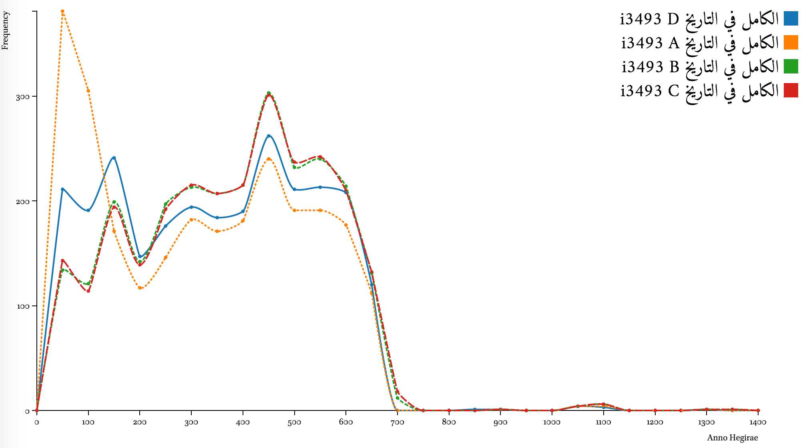
</a>
</figure>
Results for Ibn Aṯīr’s _al-Kāmil fī-l-taʾrīḫ_ are less precise: both algorithms overfitted 1st-century dates, inflating other centuries, if compared to manually disambiguated data (D). The peaks of distribution—the shape of the curve—are much closer to the benchmark than the preprocessed results (A), but computational analysis suggests that Ibn Aṯīr focuses more on the later period, while (according to manually disambiguated data) his attention is spread more evenly.

### _Ṭabaḳāt al-šāfiʿiyyaŧ_ of Ibn Ḳāḍī Šuhbaŧ (d. 851/1447 CE)
<figure class="fit">
<!-- {{ site.url }} :: .. -->
<a href="../images/chrono/manual_tshk_10_ABCD.png" title="">
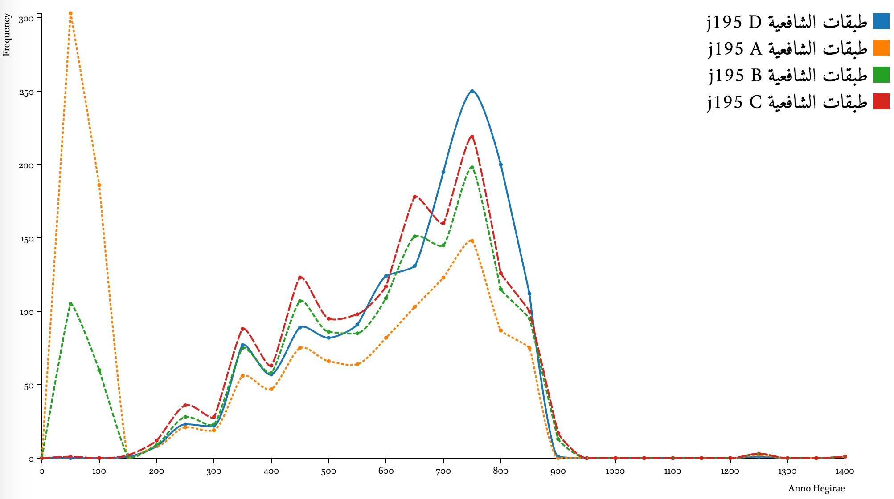
</a>
</figure>

Results for the _Ṭabaḳāt al-šāfiʿiyyaŧ_ of Ibn Ḳāḍī Šuhbaŧ are not ideal, but still much better than the initial results. Extending the check range from 500 words to 1,000 gets the graph—line C in particular—much closer to the benchmark (click on the image to see the graph based on the extended range of 1,000 words). The problem, however, is that for other sources 1,000-word range does not generate better results.

## Some general observations

We are clearly not getting 100% match with the benchmark, but that is not to be expected anyway—none of the exploratory computational methods work that way. Our model does not take into account the stylistic differences among authors. While the ballpark of date statements do fall into the proposed pattern there are occasionally slight variations that are peculiar to particular authors. Some of such peculiarities may be helpful. For example, Ibn Ḫallikān often uses phrases _li-l-hiǧraŧ_ or _min al-hiǧraŧ_ with the true 1st-century date statements (which is still 75-80%)—and such markers can be worked into the algorithm; other authors—about half a dozen that I checked thoroughly—use such additional phares only occasionally. Other peculiarities are too complicated and cannot be resolved with simple algorithms. For example, Ibn Ḳāḍī Šuhbaŧ occasionally “spells” out ones in his date statements to ensure that his readers get it right: _sanaŧ sabʿ **bi-taḳdīm al-sīn** wa-ʿišrīn ..._, “the year seven, with _sīn_ in the beginning...”), which, again, breaks the general pattern for date statements. The most complicated issue, however, is that even for a scholar it may occasionally be difficult to figure what century a certain date refers to (for example, when a biographee was born close to the middle of one century and died close to the middle of the next one). Natural languages will always pose such difficulties, yet, the results produced with the offered approach are quite suitable for the goal: even when we do not get the exact results, we are still getting close enough to the benchmark for a useful distant reading of a large corpus.

The precision of results also varies because of differencies in book structure. We get more precise projections for books organized alphabetically—in this case authors cannot afford to use too many incomplete dates (see graphs for the _Hadiyyaŧ al-ʿārifīn_ and _Wafayāt al-aʿyān_ above); and less precise for books organized chronologically. It would make sense to develop different subroutines for processing texts based on their organization. Having robust metadata on each text would help triggering analytical routines adjusted to various peculiarities, although the structure of a book can be inferred computationally (on this see below). Additionally, a more precise logic can be implemented if our texts are properly divided into logical units. Thus, in a book organized alphabetically, the analysis of dates would be limited to a single logical unit, while in a book organized chronologically the precision of analysis can be inforced by looking into date statements in the neighboring units. At this point, results are provocatively suggestive—but in most cases some familiarity with a specific book will help make sense of its graphs.

## Complementary coverage of “continuations”

Date statements may also offer other useful insights into Arabic historical sources. Comparing chronological coverage of different texts may offer an illustration of how text related to each other. Graphs below show a few examples of how certain texts are overlapping chronologically with their “continuations” (_ḏayl_, _takmilaŧ_, _ṣilaŧ_) and are complemented by them.

<figure class="half">
<!-- {{ site.url }} :: .. -->
<a href="../images/chrono/complement_1.png" title="">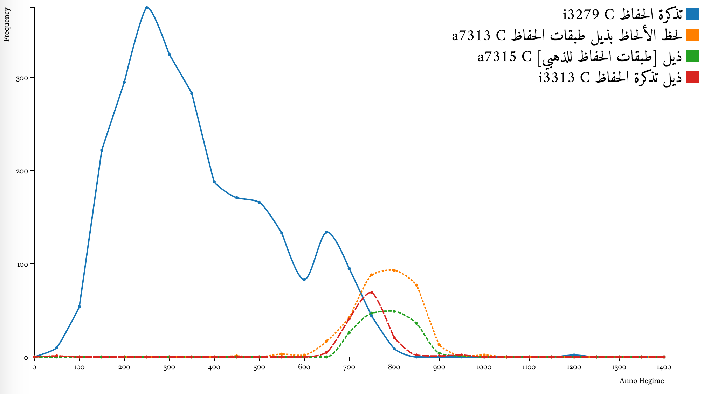</a>
<a href="../images/chrono/complement_2.png" title="">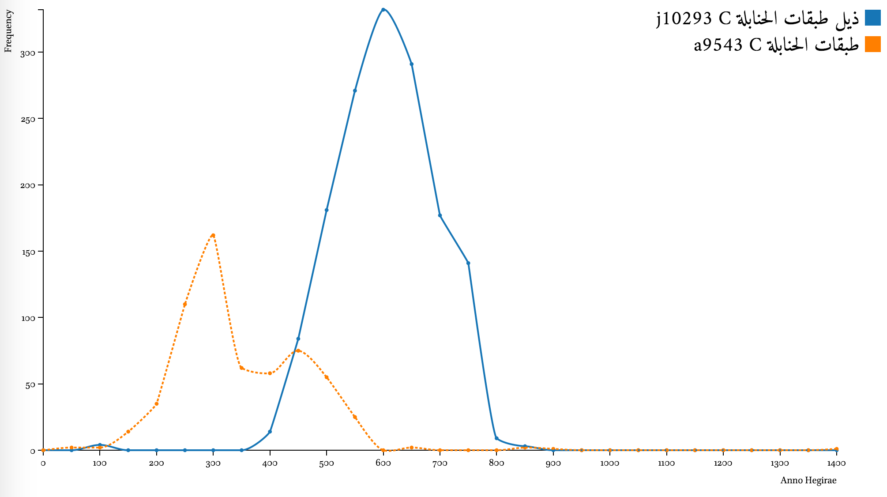</a>
<a href="../images/chrono/complement_3.png" title="">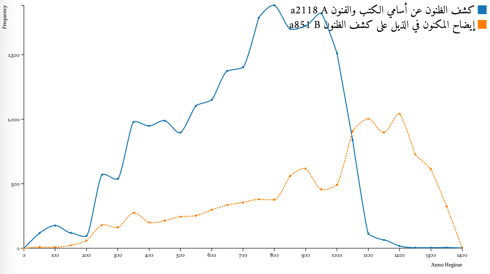</a>
<a href="../images/chrono/complement_4.png" title="">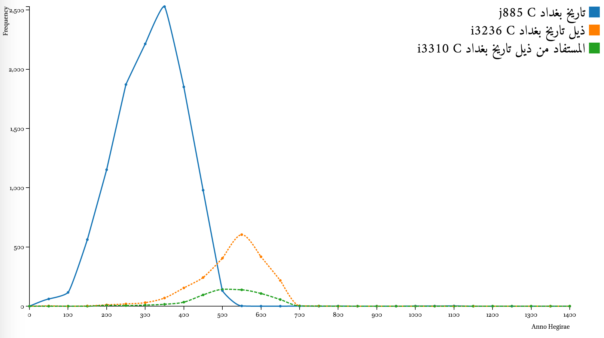</a>
 <figcaption>
      <b>Complementary coverage of “continuations”</b>. [<b>Top left</b>] al-Ḏahabī’s <i>Taḏkiraŧ al-ḥuffaẓ</i> and its three <i>ḏayl</i>s. [<b>Top right</b>] Ibn Abī Yaʿlá’s <i>Ṭabaḳāt al-ḥanābilaŧ</i> continued by Ibn Raǧab’s <i>Ḏayl ʿalá Ṭabaḳāt al-ḥanābilaŧ</i>. [<b>Bottom left</b>] Ḥaǧǧī Ḫalīfaŧ’s <i>Kašf al-ẓunūn</i> continued by Ismāʿīl Bāšā al-Baġdādī’s <i>Iḍāḥ al-maknūn fī ḏayl ʿalá Kašf al-ẓunūn</i>. [<b>Bottom right</b>] al-Ḫaṭīb’s <i>Taʾrīḫ Baġdād</i> continued by Ibn Naǧǧār’s <i>Ḏayl</i> (excerpted by Ibn al-Dimyāṭī in his <i>al-Mustafād min Ḏayl Taʾrīḫ Baġdād</i>).
  </figcaption>
</figure>
 

<figure class="fit">
<!-- {{ site.url }} :: .. -->
<a href="../images/chrono/complement_5.png" title="">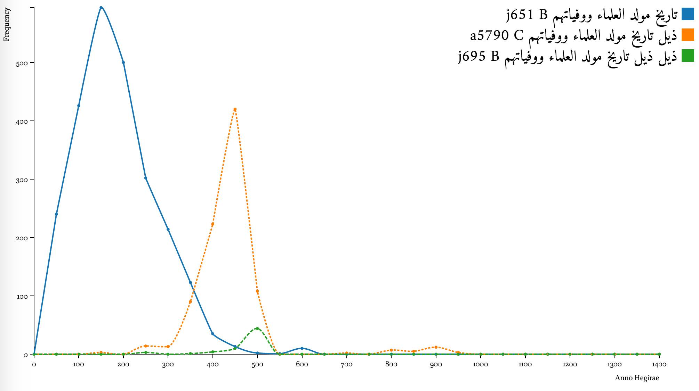</a>
 <figcaption>
      <b>Complementary coverage of “continuations.”</b>  <i>Taʾrīḫ mawlid al-ʿulamāʾ wa-wafayati-him</i> of Ibn ʿAbd Allãh al-Rabaʿī (d. 397/1006 CE) is another interesting example, since we have its “continuation”, <i>Ḏayl taʾrīḫ mawlid al-ʿulamāʾ wa-wafayati-him</i> of ʿAbd al-ʿAzīz al-Kattānī (d. 466/1073 CE), and “the continuation of the continuation”, <i>Ḏayl ḏayl taʾrīḫ mawlid al-ʿulamāʾ wa-wafayati-him</i> of Hibaŧ Allãh al-Akfānī (d. 524/1130 CE). The graph vividly demonstrates how these collections complement each other chronologically.
  </figcaption>
</figure>

# Date statements and the structure of books

Patterns of date statements distribution across texts—in other words, if we graph dates in the order they occur in a text—can also tell us a lot about the structural organization of books. As the illustrations below show, alphabetical and chronological structures have distinct visual patterns. Such patterns can be helpful in assessing new corpora and identifying texts relevant for specific research purposes. Different routines can be developed for the identification and analysis of texts of other forms and genres. 

> **Note on graphs below:** Each line represents a date statement, where the length of the line corresponds to the year that a date statement refers to. The left side of each graph is the beginning of the book; the right one—its end. Regression analysis—here visualized with the red line for linear regression, and the blue one for LOWESS regression—can be used for identifying the patterns of distribution without graphing. (1st-century dates were removed to make patterns more clear.)

<figure class="fit">
<!-- {{ site.url }} :: .. -->
<a href="../images/chrono/td_dates.png" title="">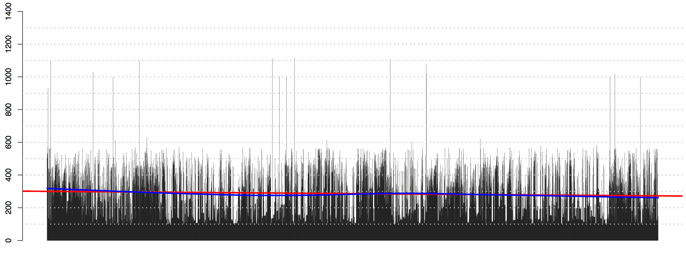</a>
<a href="../images/chrono/ww_dates.png" title="">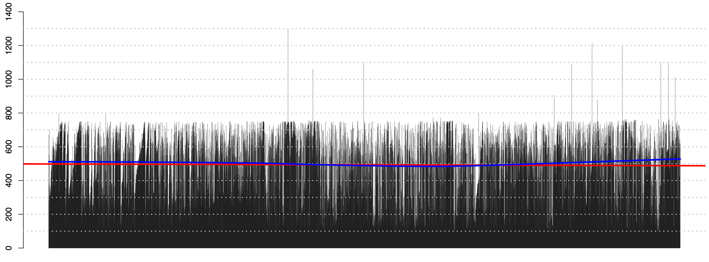</a>
 <figcaption>
      <b>Distribution of dates across historical texts:</b> Dates in the <i>Taʾrīḫ Dimašḳ</i> (top) are randomly distributed across the entire length of the text, which corresponds to its alphabetical organization; the same pattern can be seen in the <i>al-Wāfī bi-l-wafayāt</i> (bottom), which is also organized alphabetically.
  </figcaption>
</figure>

<figure class="fit">
<!-- {{ site.url }} :: .. -->
<a href="../images/chrono/ti_dates.png" title="">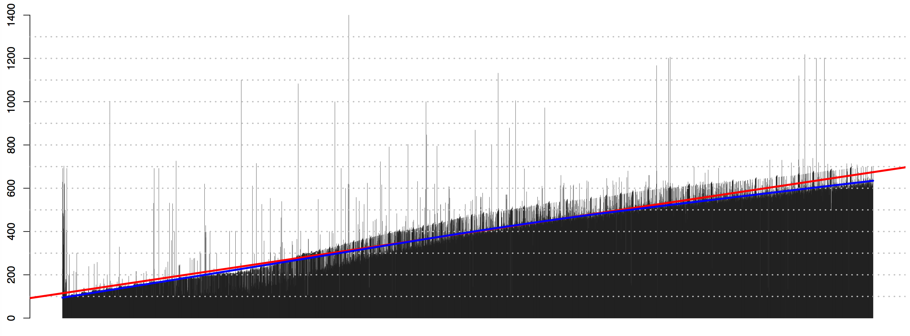</a>
 <figcaption>
      <b>Distribution of dates across historical texts:</b> Dates in the <i>Taʾrīḫ al-islām</i>, which covers the period of Islamic history up to 700/1300 CE, display a clear rising pattern, which reflects its chronological organization.
  </figcaption>
</figure>

<figure class="fit">
<!-- {{ site.url }} :: .. -->
<a href="../images/chrono/ha_dates.png" title="">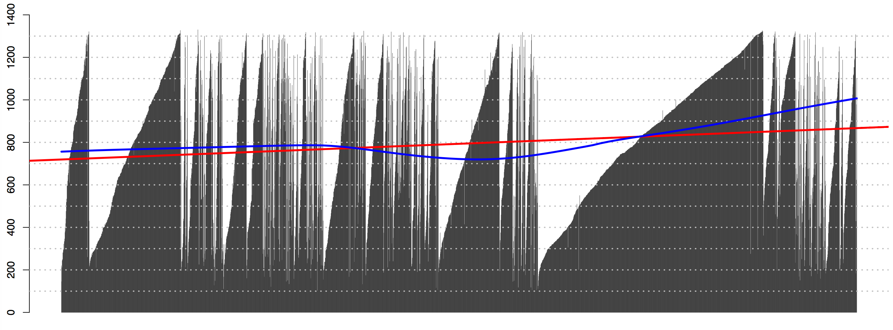</a>
 <figcaption>
      <b>Distribution of dates across historical texts:</b> Dates in the <i>Hadiyyaŧ al-ʿārifīn</i> display a zig-zag pattern, which reflects its alphabetical organization, where biobibliographical records within each letter are organized chronologically (This last thing was quite a discovery—even though I have spent quite a lot of time working with this text, I did not realize that biographies within each letter are organized chronologically until I saw this graph).
  </figcaption>
</figure>

# Concluding remarks

One thing that must be voiced is that if we had a corpus properly prepared by scholars and for scholars that would include robust metadata and texts tagged into logical units, the results of such an experiment would have been significantly more precise and reliable, not to mention that such a corpus would also allow to run a number of other exploratory experiments. To put it differently, we—scholars who study the premodern Islamic world, and who are actively using collections developed in Arab countries and Iran for non-academic purposes (and let’s be honest, most of us do)—must invest time and effort into the development of a digital library that would allow all of us to engage in methodologically novel research. Such a library would also allow to build on the each other’s research more consistently, which would also help to forge a new collaborative culture that will be beneficial to the entire field.  

# Appendix I: Exploring coverage of historical sources

<figure class="fit">
<!-- {{ site.url }} :: .. -->
<a href="../projects/chronoplot/chronoCoverageNew.html" title="">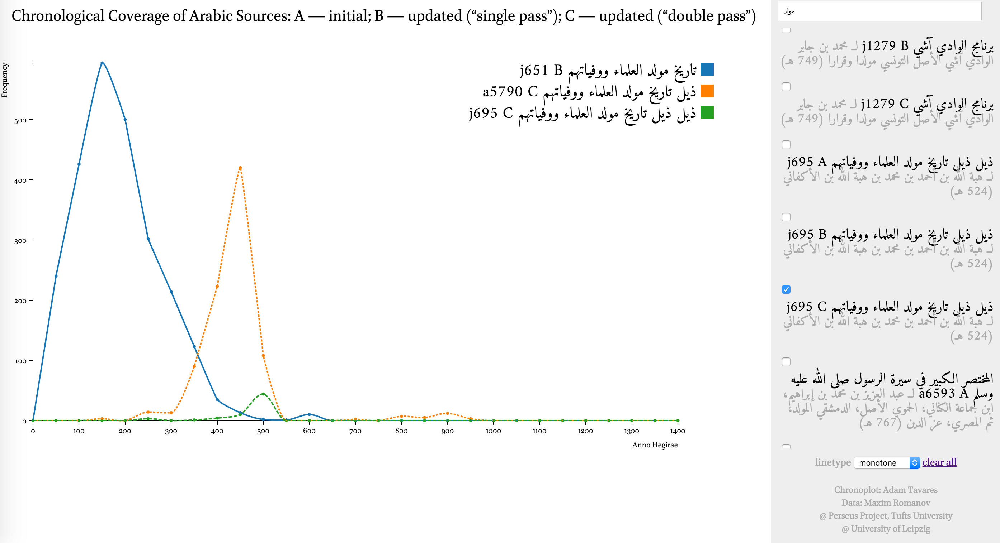</a>
</figure>

You can explore the chronological coverage of historical texts using [*Chronoplot*](../projects/chronoplot/chronoCoverageNew.html) (it may take a moment to load). Current data includes about 3,000 texts (including versions of the same text from different libraries). Keep in mind the following:

1. Each text has a unique identifier: _letter + number_, where the former refers to a collection, and the latter—to the number of a text in that collection:
  - **j** — _al-Ǧāmiʿ al-kabīr_;
  - **a** — _[al-Maktabaŧ al-Šāmilaŧ](http://shamela.ws/)_;
  - **i** — [_al-Maktabaŧ al-Šīʿiyyaŧ_](http://shiaonlinelibrary.com/).
2. Each text has three variations of date statement distribution. (Consider comparing variations for the text with the same identifier.) Texts of the same title from different collections occasionally give different distributions (especially when electronic texts are based on different printed editions).
  - **A** — unmodified dates (“1st century problem”);
  - **B** — updated dates (“single pass”);
  - **C** — updated dates (”double pass”)
  3. *Selector* (right) can be used to select titles for graphing their chronological coverage. Choosing multiple titles will allow to compare their coverages.
  4. *Filter* (right top) can be used to find specific titles: type a part of an author’s name or a book’s title, and the list will be filtered to show only items that have your keywords.
  5. *Linetype* (right bottom) is a drop-down menu that offers several ways graphing the results. The most appropriate linetype for displaying chronological coverage is “step-before,” since it shows the frequencies of date statements per 50-year periods in the most clear manner. However, this works well only for single texts. For comparative purposes “monotone” seems to be a better option.

# Appendix II: Exploring coverage of historical periods

The table below lists sources by frequencies of date statements. Like _Chronoplot_, this table also has three variations of each text (A, B, C). Since variations A, B, and C differ only in how dates are distributed across periods, the initial table shows only variation A. Selecting a particular century will show only texts (with variations) that have dates for those periods.

Metadata on texts is not always complete. The missing information may be available online—where applicable, links to the online manifestations of texts are provided.

<h2 id="mainTable_h1"></h2>

<b>By centuries:</b>  

 

<head>
<link rel="stylesheet" href="/files/chronoTable.css">
</head>

