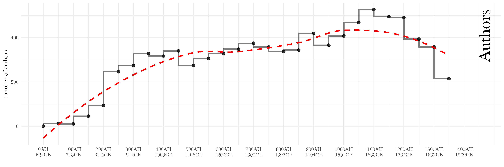
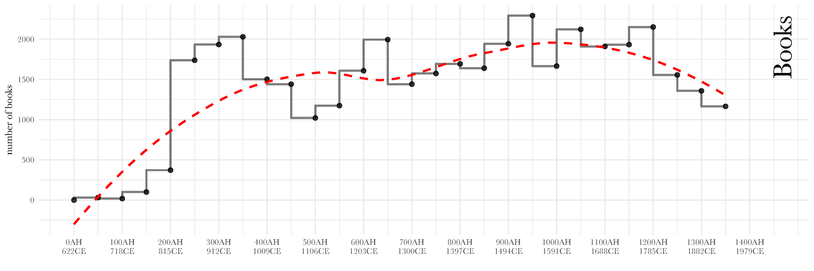
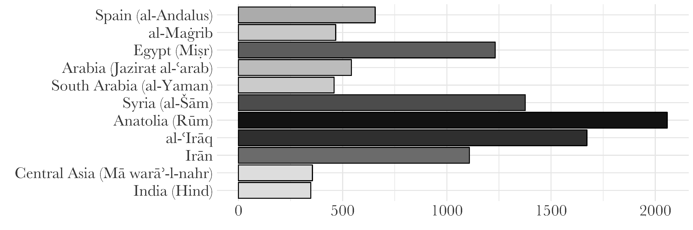
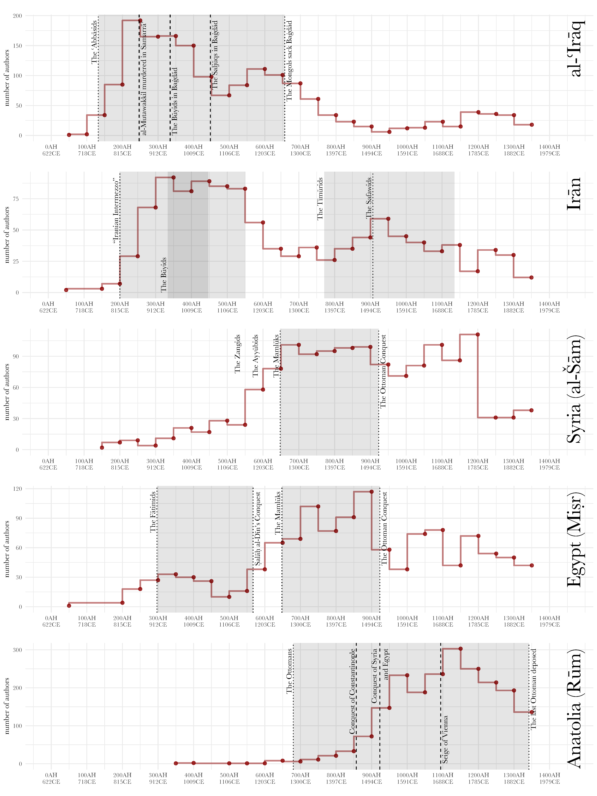

---
header:
  image: /images/covers/03895u_a.jpg
  caption: "**Photo credit**: Pont de Galatha. *Library of Congress*, [LC-DIG-ppmsca-03895](http://hdl.loc.gov/loc.pnp/ppmsca.03895)"
title:			"Cultural Production in the Islamic World"
author_profile:		true
layout:		single
categories:
  - Biographical Literature
  - Bibliographical Literature
  - Arabic
tags:
  - Blogpost
---

Biographical and bibliographical texts can offer a valuable insight into the process of cultural production in the Islamic world. One of the most relevant texts is the <em>Hadiyyaŧ al-ʿārifīn</em> (“The Gift to the Knowledgeable”)—a bio-bibliographical collection written by Ismāʿīl Bāšā al-Baġdādī (d. 1338/1919 CE). Although <em>de facto</em> the text is modern, it follows very closely in the footsteps of medieval texts of this kind and is effectively the part of the tradition; additionally, chronologically, we get the most extensive coverage from this collection as it covers the period from the beginning of Islam in the 7th century CE up to the end of the 19th century CE.

From the very little that we know about him,<a href="#fn14" class="footnoteRef" id="fnref14">14</a> Ismāʿīl Bāšā wrote two extensive bibliographical texts—the first one, <em>Īḍāḥ al-maknūn fī Ḏayl ʿalá Kašf al-ẓunūn</em>, is the continuation of the famous <em>Kašf al-ẓunūn</em> of Ḥāǧī Ḫalīfaŧ (d. 1067/1656 CE),<a href="#fn15" class="footnoteRef" id="fnref15">15</a> which mirrors its structure with the main unit being the work and them all organized alphabetically; the second one is the <em>Hadiyyaŧ al-ʿārifīn</em>, which contains essentially the same information, but grouped into biographical records, where all works attributed to a given author are listed after a short biography.<a href="#fn16" class="footnoteRef" id="fnref16">16</a> The <em>Hadiyyaŧ al-ʿārifīn</em> is organized alphabetically, and then chronologically within each letter.<a href="#fn17" class="footnoteRef" id="fnref17">17</a>

Although one cannot possibly expect for such a collection to be comprehensive and exhaustive, this is the largest bibliography of books written in the Islamic world that we have available. So, we can still hope to get valuable insights into cultural production—the appearance of new works—in the Islamic world up until the beginning of the 20th century. For the sake of space and the mere fact that the analysis of this collection deserves a separate study, I will focus on broad spatial and chronological patterns that can be discerned in the data.

<h2 id="insight-1-cultural-production-over-time">Insight 1: cultural production over time</h2>

Figure 5. Chronological distribution of authors

First of all, our algorithmic analysis allows us to get a better understanding of the overall coverage of the collection itself: it includes almost 8,800 authors and over 40,000 book titles—with most authors being attributed 1 to 4 titles (<em>interquartile range</em>). The overall chronological distribution of authors (Figure <a href="#fig:authors">5</a>) displays a steady upward trend up until 1200/1785 CE, reflecting the general historical situation: as the Islamic world keeps expanding geographically and the Muslim population growing, we find more individual getting involved in the process of cultural production.

Displaying the same trend for the period up 1200/1785 CE, the graph of books (Figure <a href="#fig:books">6</a>) makes the prominent early period (200–450 AH / 815–1058 CE) more noticeable. Although this period is usually strongly associated with the translation movement from Greek into Arabic,<a href="#fn18" class="footnoteRef" id="fnref18">18</a> it is probably even more important for the formation of Islam as a religious system: particularly for the development of the Ḥadīṯ canon<a href="#fn19" class="footnoteRef" id="fnref19">19</a> and the crystallization of theological views.<a href="#fn20" class="footnoteRef" id="fnref20">20</a> Spikes are also due to a few very prominent polymaths: al-Suyīṭī (d. 911/1505 CE)—585 works; Ibn ʿArabī (d. 638/1240 CE)—425 works; al-Kindī (d. 256/870 CE)—256; al-Madāʾinī (d. 225/840 CE)—223 works; al-Nābulusī (d. 1143/1730 CE)—204; Ibn al-Jawzī (d. 597/1200 CE)—201 works, and quite a few other prolific authors.

Figure 6. Chronological distribution of books

The decline of both graphs after 1200/1785 CE most likely indicates the unavailability of bibliographical information to our author. The geographical coverage of the collection also starts shrinking roughly at the same period. It should be noted that all chronological datasets tend to exhibit this trend. For example, the trend can be observed in al-Ḏahabī’s own continuation, <em>Ḏayl</em>, to his massive “The History of Islam” (<em>Taʾrīḫ al-islām</em>), where the number of biographies per period drops dramatically. One can equally see this in Brill’s bibliographical database <em>Index Islamicus</em> as well as in <em>Harvard Open Metadata</em> on 12 million books that Harvard libraries hold. The only difference is that the lag gets shorter as we get closer to our time—for premodern Arabic sources this lag is 100 to 150 years; in modern datasets—10 to 20 years.

Figure 7. Regional Contributions.

Splitting our data geographically—Figure <a href="#fig:regions">7</a>—we can also discover which regions played the leading role in cultural production. What we discover from the results is that, as we suspected, the collection does not cover all the regions of the Islamic world, particularly regions that became part of the Islamic world in the later periods and in geographical terms remained peripheral to the core: Subsaharan Africa, the Indonesian Archipelago, the Volga region, and Eastern Europe. At the same time, all core regions—the historical heartlands—of the Islamic world are covered quite well.

It should be pointed out that the bar chart here shows the <em>presence</em> of authors in those regions, as many of them traveled (sometimes extensively) and composed their books at different locations. In other words, our biographee—who lived in Nishapur, but died in Mecca—appears both in the column of Iran (Īrān) and that of Arabia (Jazīraŧ al-ʿarab). Such treatment of data is also justified because regions in their prime tend to attract people from less prosperous ones.

Figure 8. Most prominent Islamic regions over time.

We can get a better understanding of regional contributions by graphing regional data chronologically—Figure <a href="#fig:regionsOverTime">8</a> shows the top five contributing regions: Anatolia (Rūm), Iraq (al-ʿIrāq), Iran (Īrān), Syria (al-Šām), and Egypt (Miṣr) are homes to the highest number of individuals engaged in cultural production across the Islamic world. The chronological distribution of authors in those regions (as well as in the regions that are not graphed here) display a rather distinct pattern: cultural production is on the rise during economic and political stability, usually marked by the early rule of strong dynasties: the ʿAbbāsids in Iraq; dynasties of the “Iranian intermezzo”, followed by the Tīmūrids and the Ṣafawids in Iran; the Mamlūks in Syria and Egypt;<a href="#fn21" class="footnoteRef" id="fnref21">21</a> the Ottomans in Anatolia. It should be noted, however, that the increase in cultural production in these cases is not necessarily due to rulers’ patronage, but, rather due to the stability and predictability of social and economic life that their rule brings about. Although many rulers did act as patrons of “fine literature,” most books in the <em>Hadiyyaŧ al-ʿārifīn</em> deal with religious subjects—Qurʾānic exegesis, “words of the Prophet” (Ḥadīṯ), Islamic law, etc.—and they were composed more in the framework of the development of local religious communities, whose florescence depended on the overall political and economic stability. In this regard, the example of Iraq might be quite telling: the early period of ʿAbbāsid rule is marked by a very significant rise, which comes to a halt when the ʿAbbāsids lose their sovereignty and become the puppets first, of their generals, then—the Būyids, and then—the Saljūqs, regaining their power only briefly at the end of their rule, which is ended dramatically by the Mongol invasion. Needless to say, the real historical picture is always more complicated than space of this article allows.

<h2 id="insight-2-cultural-connections">Insight 2: Cultural Connections</h2>

Our bio-bibliographical data also offers a significant amount of geographical information, with which one can model geographical networks of connections. A network of an individual can be represented by connecting all places mentioned in that individual’s biography—Figure <a href="#fig:conceptualMap">9</a> shows the geographical network from our sample biography, where possible paths are generated from the route network of that period using the shortest path (Dijkstra algorithm) and the optimal path (modified Dijkstra algorithm that avoids stretches with a small number of settlements along the way).

Figure 9. Geographical network of the biographee from the sample biography (using our al-Ṯurayyā Gazetteer, (<a href="https://althurayya.github.io/"><code>https://althurayya.github.io/</code></a>).

For our purposes, however, a bit more simplified approach for modeling the network will work better. First of all, we want to move from the level of settlements to the level of regions: they become the nodes, which are connected with each other directly—as the crow flies—without using route networks.<a href="#fn22" class="footnoteRef" id="fnref22">22</a> In the case of our sample biography, the network is thus simplified to a single arc between Iran and Arabia. One can then combine route networks of a particular group of individuals in order to see a broader pattern. Arguably, by combining individual networks from specific periods—with every shared node becoming bigger, and every shared edge thicker—one can get an idea of how the Islamic world was connected in that particular period, and more interestingly, what constituted its core: namely, the constellation of most prominent and inter-connected regions.

Figure 10. The Iraqi-Iranian core in the 12th century CE.

Practically up until 1200 CE (Figure <a href="#fig:12th">10</a>), Iraq and Iran remain the core of the Islamic world:<a href="#fn23" class="footnoteRef" id="fnref23">23</a> they are strongly connected with each other—a very significant number of the men of letters (mostly, religious scholars who write predominantly in Arabic) come from Iran during this period. Spain (al-Andalus), which, based on our data, thrives during the 10–13th centuries, forms more of its own core with North Africa (al-Maġrib). The West and the East are too far from each other to maintain strong connections.

Figure 11. Massive migrations of the 13th century CE.

During the 13th century CE (Figure <a href="#fig:13th">11</a>), we find the strongest connections among the eastern and western regions of the Islamic world. Although one might expect this to indicate a certain tranquility that permitted travel, what we see is in fact the result of the crises both in the East and the West of the Islamic world. In Spain, Muslims are losing their ground and a significant number of scholars start moving east to North Africa, Egypt and Syria; Iran and Iraq are suffering from their own crises, most notably—“The Big Chill” of the 11th–early 12th centuries CE, which destroys the economic prosperity of the Iranian regions and pushes nomads from the Turco-Mongolian steppe further and further into the Iranian plateau.<a href="#fn24" class="footnoteRef" id="fnref24">24</a> The Mongols usually take the blame for the destruction of the great cities of Iran and Iraq (most notably, Baġdād), however, judging by the data from biographical collections, by the time they show up and deliver the finishing blow all the previously prominent urban centers are long in decline. It is during this period that we find Iranians and Iraqis leaving their homes, relocating to Syria and Egypt, which in the two centuries to follow form a new core under Mamlūk rule (Figure <a href="#fig:15th">12</a>).

Figure 12. New Mamlūk core of the 14th and 15th centuries CE.

The 16th century marks a significant reconfiguration of the Islamic world: most notably with the rise of the “gunpowder empires”—the Ottomans in Anatolia (Rūm) and their successful conquests of the former core—Mamlūk Syria and Egypt; the Ṣafawids in Iran, and the Mughals in India (<em>not graphed here</em>). Figure <a href="#fig:16th">13</a> displays this reconfiguration marked by the rise of the Ottoman Empire and the reorientation of Iran, when significant numbers of Iranian scholars begin moving to Anatolia, but even more so to India.<a href="#fn25" class="footnoteRef" id="fnref25">25</a>

Figure 13. Reconfiguration of the 16th century CE.

The last map—Figure <a href="#fig:18th">14</a>—shows the split of the Islamic world into two distinct cores of the Ottoman Empire which gains control over almost entire Arab world and the Indo-Iranian core. This split begins in the 17th century and remains equally distinct in our data up until the end of the 19th century.

Figure 14. The Turco-Arabic and Indo-Iranian cores in the 18th century.

<b>* * *</b>

These graphs and maps show only a fraction of what can be done with the data extracted from a single biographical collection.<a href="#fn26" class="footnoteRef" id="fnref26">26</a> The next logical step is to study data from <em>all</em> available biographical collections—this step, however, requires a significant level of formalization and infrastructural development.

<b>NB</b>: This is an excerpt from: Romanov, Maxim. “Algorithmic Analysis of Medieval Arabic Biographical Collections.” <i>Speculum</i> 92, no. S1 (October 2, 2017), S226–46. doi:10.1086/693970. The full text is available in open access @ <a href="http://www.journals.uchicago.edu/doi/full/10.1086/693970">http://www.journals.uchicago.edu/doi/full/10.1086/693970</a>

<h2 id="scaling-things-up"><i>Footnotes</i> </h2>

<ol start="14">
<li id="fn14">
See, Witkam, J.J., “Ismāʿīl Pas̲h̲a Bag̲h̲dādli̊”, in <em>EI2–Online</em>. For the edition of this text, see: Ismāʿīl Bāšā al-Baġdādī, <em>Hadīyaŧ al-ʿārifīn asmāʾ al-muʾallifīn wa-aṯār al-muṣannifīn</em>, 6 vols. (Bayrūt: Dār al-kutub al-ʿilmīyaŧ, 1992).<a href="#fnref14">↩</a>
</li>
<li id="fn15">
He is also known as Kātib Čelebi, see: Şaik Gökyay, Orhan, “Kātib Čelebi”, in <em>EI2–Online</em>.<a href="#fnref15">↩</a>
</li>
<li id="fn16">
The majority of works listed in the <em>Hadiyyaŧ al-ʿārifīn</em> are in Arabic, “the Latin of the Islamic world”, although there is also about 10% of books written in Persian and Turkish (the language is either explicitly mentioned, or the title of a work includes a Persian or Turkic word—most commonly, <em>nāmah</em>, Pers./Turk. “book”); Persian and Turkish works are not excluded from the analysis.<a href="#fnref16">↩</a>
</li>
<li id="fn17">
It is worth pointing here that, when it comes to biographical material, alphabetical organization is secondary in Islamic culture; the primary form of organization would be chronological, divided into “generations” or “cohorts” (sing. <em>ṭabaqaŧ</em>)—authors of later generations would often take this information, edit, supplement and reorganize alphabetically. See, Franz Rosenthal, <em>A History of Muslim Historiography</em> (Leiden: E. J. Brill, 1952), passim: al-Saḫāwī’s <em>al-Iʿlān bi-l-tawbīḫ</em>, translated in Rosenthal’s book, is particularly rich on notes about who updated and reorganized whose work.<a href="#fnref17">↩</a>
</li>
<li id="fn18">
Dimitri Gutas, <em>Greek Thought, Arabic Culture: The Graeco-Arabic Translation Movement in Baghdad and Early ʻAbbāsid Society (2nd-4th/8th-10th Centuries)</em> (London ; New York: Routledge, 1998). <a href="#fnref18">↩</a>
</li>
<li id="fn19">
See, for example, “Phase 3: The age of ‘six books’” (<em>c.</em> 200–400/912–1009) in: Scott C. Lucas, <em>Constructive Critics, Ḥadīth Literature, and the Articulation of Sunnī Islam: The Legacy of the Generation of Ibn Saʿd, Ibn Maʿīn, and Ibn Ḥanbal</em> (Leiden ; Boston: Brill, 2004), 73–86. <a href="#fnref19">↩</a>
</li>
<li id="fn20">
According to the <em>Hadiyyaŧ al-ʿārifīn</em>, about 90% of almost 500 “refutations” (Ar. <em>radd</em>) of different groups and specific beliefs were written during this period (peaking 250–450 AH / 864–1058 CE).<a href="#fnref20">↩</a>
</li>
<li id="fn21">
The rule of the Fāṭimids in Egypt marked the shift in the ideology—from Sunnism to Ismāʿīlī Shiʿism—which featured the rise in numbers of Ismāʿīlī writings, however, these numbers are overshadowed by the decline in Sunnī writings—as well as in Sunnī communities in general—in Egypt. On Ismāʿīlī authors, see Ismail K. Poonawala and Teresa Joseph, <em>Biobibliography of Ismāʿīlī Literature</em>, Studies in Near Eastern Culture and Society. (Malibu, Calif.: Undena Publications, 1977), 467–69.<a href="#fnref21">↩</a>
</li>
<li id="fn22">
The problem with the route network is that they change over time and it is very difficult to recreate route networks for all the periods covered in our collection; more importantly, however, route networks will forefront the most traveled sections of the network, rather than the density of connections among the regions.<a href="#fnref22">↩</a>
</li>
<li id="fn23">
As I show elsewhere, on data from a significantly larger biographical collection, the core for this period is more complex, particularly since what we come to understand as “Iran” in that period is several major provinces, with almost each one of them being similar in size to Iraq. See, Maxim Romanov, “After the Classical World: The Social Geography of Islam (c. 600—1300 CE),” in <em>ARS ISLAMICA: Festschrift in Honor of Stanislav Mikhailovich Prozorov</em>, ed. Mikhail Piotrovsky Alikber Alikberov (Moscow: Russian Academy of Sciences (Institute of Oriental Studies) &amp; “Vostochnaya Literatura”, 2016), 247–77.<a href="#fnref23">↩</a>
</li>
<li id="fn24">
See, most notably, Richard W. Bulliet, <em>Cotton, Climate, and Camels in Early Islamic Iran: A Moment in World History</em> (New York: Columbia University Press, 2009). <a href="#fnref24">↩</a>
</li>
<li id="fn25">
See, for example, Masashi Haneda, “Emigration of Iranian Elites to India During the 16-18th Centuries,” <em>Cahiers d’Asie Centrale</em>, no. 3 (October 1, 1997): 129–43, <a href="https://asiecentrale.revues.org/480" class="uri">https://asiecentrale.revues.org/480</a>. <a href="#fnref25">↩</a>
</li>
<li id="fn26">
For more examples of such analysis of data from a different collection, see: Maxim Romanov, “Toward Abstract Models for Islamic History,” in <em>The Digital Humanities and Islamic &amp; Middle East Studies</em> (Berlin, Boston: De Gruyter, 2016), 117–49, <a href="http://www.degruyter.com/view/books/9783110376517/9783110376517-007/9783110376517-007.xml" class="uri">http://www.degruyter.com/view/books/9783110376517/9783110376517-007/9783110376517-007.xml</a>. <a href="#fnref26">↩</a>
</li>
</ol>

