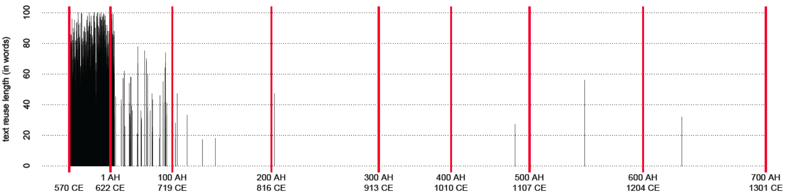
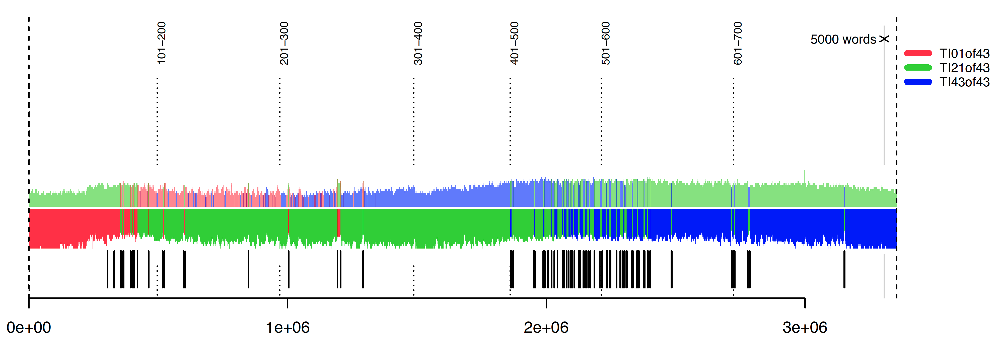

---
header:
  image: /images/covers/03889u.jpg
  caption: "**Photo credit**: Kairouan. The Mosque of the Swords. *Library of Congress*, [LC-DIG-ppmsca-03889](http://hdl.loc.gov/loc.pnp/ppmsca.03889)"
title:			"A Digital Humanities for Premodern Islamic History"
author_profile:		true
layout:		single
categories:
  - Digital Humanities
  - Text Reuse
  - Text Analysis
  - Computational Methods
  - al-Ḏahabī
  - Arabic
tags:
  - Blogpost
---

Defining digital humanities is tricky. Our scholarship has been intrinsically digital for quite a few decades already, as we rely more and more on electronic storage to save, word processors to write, bibliography managers to organize, databases to consult, digital libraries to search and read. Living in the digital world, however, does not make us all digital humanists—if these digital entities are taken away, we will have their analog prototypes to fall back on, and beyond a certain level of inconvenience, this will not affect the way most of us do our scholarship. The transition to digital humanities must begin somewhere at the point where our humanistic inquiry starts to rely on the machine as the matter of methodological exigency.

In some ways digital humanities is also a “no man’s land” that, within every national context, is most successfully claimed by scholars of national histories, literatures, and languages—by virtue of their higher numbers and the accessibility of their subjects to national funding agencies and the wider public. In practical terms, one’s primary field of academic inquiry, with its specific research questions and available source base, determines the set of computational approaches and thus defines a specific instance of digital humanities. (Without a primary field of academic inquiry we would be talking about technicians rather than scholars.) For example, although methods for analysis of video and audio recordings will be of little practical value to a scholar of premodern Islamic history, there is a lot to be gained from methodological areas such as computer vision,[^fn2] social network analysis, geographical information systems (GIS), and, most importantly, text analysis.

[^fn2]:  We already have methods to make manuscripts searchable (although in a limited way) and soon we should be able to group manuscripts by similarities in handwriting as well as to identify manuscripts written by the same hand. See, for example, Mike Kestemont and Dominique  Stutzmann, “Script Identification in Medieval Latin Manuscripts Using Convolutional Neural Networks,” *Digital Humanities 2017: Book of Abstracts* (Montreal, August 10, 2017), 283–85. 

To build a case for text analysis methods, let’s consider the example of the _Taʾrīḫ al-islām_ (“History of Islam”) by al-Ḏahabī (d. 1348). This book of great length and coverage, whose 50 volumes[^fn3] containing 3.6 million words—the size of *War and Peace* six times over—trace the first 700 years of Islamic history through the description of historical events and some 30,000 biographies. Although a great number of modern scholars use this massive “obituary chronicle” as their major source, we hardly have a decent understanding of its inner organization. With a significant amount of Arabic historical texts available, we can employ the text-reuse identification method developed by [David Smith](http://www.ccis.northeastern.edu/people/david-smith/) of Northeastern University to build the equivalent of an x-ray image of this chronicle, which would shed new light on this text and raise a series of important historiographical questions.

[^fn3]:  al-Ḏahabī, _Taʾrīḫ al-islām_, ed. ʿUmar ʿAbd al-Salām Tadmurī, 1st ed., 52 vols. (Bayrūt: Dār al-kitāb al-ʿarabī, 1990–99).

To begin with, we get a detailed perspective on the sources that al-Ḏahabī might have used: he mentions some forty of them that he used and in our x-ray we find traces of them (provided, of course, that we have a relevant text in our corpus, which in most cases we do) and other sources that he might have used, but failed to mention, for whatever reason. Figure <a href="#fig1">1</a> shows how passages common to al-Bayhaqī’s (d. 1066) *Dalāʾil al-nubuwwaŧ* (“Indications of Prophecy”) also feature in al-Ḏahabī’s text: the length of a black line corresponds to the number of words in an identified text reuse instance; the dense black block in the beginning of the book indicates the density of text reuse, also indicating that all these common passages occur exactly where we would expect them to appear—in the part of al-Ḏahabī’s text that deals with the period of Prophet’s life.

<figure class="fit">
	
<figcaption><b>Figure 1. Passages from al-Ḏahabī’s <i>Taʾrīḫ al-islām</i> traceable to al-Bayhaqī’s (d. 1055) <i>Dalāʾil al-Nubuwwaŧ</i> (111,436 words, 371 pages, 50% of instances 28–61 words).</b> The graph shows the flow of the text of al-Ḏahabī’s work in one hundred-word chunks: the beginning of the book is on the left, the end of the book is on the right; the red lines indicate points where al-Ḏahabī moves on to the coverage of the next <i>hijrī</i> century. Black lines indicate instances of text reuse traceable to al-Bayhaqī’s text, and the length of a black line corresponds to the number of words in an identified text reuse instance. The dense black block in the beginning of the book indicates the density of text reuse—with most of it falling on the period up until 640 CE—which means that all these common passages occur exactly where we would expect them to appear: in the part of al-Ḏahabī’s text that deals with the period of the Prophet’s life.</figcaption>
</figure>

With the help of our x-ray, not only do we discover connections with practically all the sources that al-Ḏahabī mentions in his introduction, we are also able to gauge the extent to which he engaged with his sources. We find a very significant amount of common passages with Ibn ʿAsākir’s *Taʾrīḫ Dimašq* (“History of Damascus”)—an equivalent of over 800 pages (300 words per page, 246,000 words), with al-Bayhaqī’s *Dalāʾil al-nubuwwaŧ* (“Indications of Prophecy”)—some 370 pages, with Ibn al-Jawzī’s *Kitāb al-muntaẓam* (“The Book of Rightly-Ordered Things [about Histories of Kings]”)—some 280 pages, with al-Mizzī’s *Tahḏīb al-Kamāl* (“The Refinement of Perfection”)—some 270 pages, with al-Ḫaṭīb al-Baġdādī’s *Taʾrīḫ Baġdād* (“History of Baghdad”)—some 250 pages, and so on. (Keep in mind, however, that these numbers cannot be simply added up because there is a significant amount of reuse among these texts as well). In all cases 50% of identified shared passages are 25 to 60 words long! Seeing major biographical collections and chronicles on this list is not surprising, but al-Bayhaqī’s *Dalāʾil* appears to stand out. Our text reuse data suggests that the *Dalāʾil* is the most heavily reused text—these 370 “pages” amount to almost 20% of its volume (the share of *Taʾrīḫ Dimašq*, on the other hand, is barely 2.4% of its volume). This, however, does not necessarily mean that all passages common to al-Bayhaqī were taken by al-Ḏahabī directly from al-Bayhaqī’s *Dalāʾil* because there is always a possibility of a common source or a source between the _Dalāʾil_ and the _Taʾrīḫ al-islām_. (In this particular case this is quite likely, since al-Ḏahabī lists the *Dalāʾil* among his main sources.) What it does mean is that our distant reading suggested to us a very interesting connection which deserves further close examination using more traditional methods.

Next, we may attempt to assess the cumulative level of text reuse in al-Ḏahabī’s _Taʾrīḫ al-islām_. Altogether, the currently identifiable amount of text reuse—here we count each instance of text reuse only once, even if it is traceable to multiple sources—amounts to at least 23% of al-Ḏahabī’s text (750,000 words, 2,500 pages, with 50% of quotations within 25 to 59 words). If we look at his text, century by century, we discover that for almost every century that he covered, about 20-22% of his text can be traced to passages from his sources, with the exception of the 1st and the 7th Islamic centuries, where the share of text reuse amounts to 47.8% and 8.4% respectively. These numbers confirm, first, that this text is a compilation, and second, that it is the latest material that is least derivative. While there is a tendency to dismiss such “discoveries” as nothing that scholars don’t already know, it is important to stress that they allow us to transform “intuitive knowledge” into knowledge backed by a significant amount of textual evidence, which we can then use as a reliable premise to advance our analysis further—something that otherwise would not be possible.

The importance of this seemingly trivial discovery is that, by quoting his sources so extensively, al-Ḏahabī effectively preserves their archaic language. For instance, when he writes about the 1st *hijrī* century, his narrative is dominated by quotations from texts written in the 3rd century; when about the 2nd, from the 3rd and the 4th; and when about the 3rd, from the 3rd, 4th, and the 5th, and so on. The discovery of these archeological layers of language indicates that al-Ḏahabī describes people and events with a language that is as close to contemporaneous as is feasibly possible in historiographical terms. (It is also likely that his own syntax and word choices are affected by the language of his sources.)

<figure class="fit">
	
<figcaption><b>Figure 2. Results of the rolling stylometry test.</b> Three samples of 10,000 words were taken from the beginning (red), middle (green), and end (blue) of al-Ḏahabī’s <i>Taʾrīḫ al-islām</i> and used to test to what extent the “style” of these samples is similar to the rest of the book. The graph shows that the “early style” (red), which  dominates the language of the 1st Islamic century, disappears completely by the end of the 3rd Islamic century, not reaching even the middle of the book. The style in the end of the book is completely different from that of the beginning of the book.
</figcaption>
</figure>

A rolling stylometry test[^fn4] of the _Taʾrīḫ al-islām_ further shows that al-Ḏahabī’s writing “style”—defined as a set of most frequent function words that form a writer’s “fingerprint”—changes completely by the end of this massive book: three samples of 10,000 words were taken from the beginning (red), middle (green), and end (blue) of the book and used to test to what extent the “style” of these samples is similar to the rest of the book. Figure <a href="#fig2">2</a> shows that the “early style” (red), which  dominates the language of the 1st *hijrī* century, disappears completely by the end of the 3rd century, not reaching even the middle of the book. In stylometric terms this can be interpreted that the beginning and the end of the book were written by two different people.

[^fn4]:  See, the website of the “Computational Stylistic Group” (accessed on October 6, 2017), [https://sites.google.com/site/computationalstylistics/projects/testing-rolling-stylometry](https://sites.google.com/site/computationalstylistics/projects/testing-rolling-stylometry); see also, Maciej Eder, Jan Rybicki, and Mike Kestemont. “Stylometry with R: a package for computational text analysis.” *R Journal*, 8(1), 2016, 107-121.

This discovery about the language of al-Ḏahabī’s _Taʾrīḫ al-islām_ has far reaching implications about the data that he collected. For example, although the text comes from the 14th century and inevitably suffers from 14th-century biases when it comes to the representation of the past, the description of people and events—i.e., at the linguistic level—is not as anachronistic as one would think, and, arguably, these properties of the language give us ground to use the data from this text for modeling historical processes.[^fn5]

[^fn5]: See Maxim Romanov,  “Toward Abstract Models for Islamic History,” in The Digital Humanities + Islamic Middle Eastern Studies, ed. Elias Muhanna (Berlin: De Gruyter, 2016), 117–49; and Romanov, “Algorithmic Analysis of Medieval Arabic Biographical Collections,” Speculum 92/S1 (October 2017), S1-21 (available in open access at [http://www.journals.uchicago.edu/doi/full/10.1086/693970](http://www.journals.uchicago.edu/doi/full/10.1086/693970)). 

I mentioned earlier that the overall volume of text reuse in al-Ḏahabī’s _Taʾrīḫ al-islām_ is at least 23%. Our initial text-reuse experiment was constrained by the format of our texts—or, to refer to the article in this roundtable, by the lack of a proper scholarly corpus. This means that we had to compare texts that were mechanically chunked into slices of one hundred words, and with such comparison we could have missed up to 20% of reused text; this circumstance also did not allow us to perform a more informative distant reading. As our [OpenITI corpus](https://alraqmiyyat.github.io/OpenITI/) develops and texts are supplied with logical markup (i.e., every chapter, section, subsection of a book is explicitly tagged), we will be able to run more precise and robust experiments. Comparing logical units of texts—for example, a biography with another biography—would open more opportunities for understanding how our texts were composed. For example, such an analysis will allow us to identify computationally which biographies al-Ḏahabī included from any given source and which he omitted. Knowing this would allow us to assess—on the largest scale possible—not only his selection criteria, but also what he suppressed from selected biographies and how he modified them.[^fn6] Pushing the point further, this can be accomplished for all historical titles in the [OpenITI corpus](https://alraqmiyyat.github.io/OpenITI/), which is likely to significantly change our understanding of the Islamic historiographical tradition.

[^fn6]: See Maxim Romanov, “Observations of a Medieval Quantitative Historian?,” *Der Islam* (forthcoming in 2018).

With all this said, the machine will never replace traditional training. No proper distant reading experiment can be designed without a deep understanding of the subject in question, which can only come from a fair share of close reading. The machine is just another tool in our methodological toolbox which allows us to do something that other methods don’t. The machine will never ask novel historical questions, but it will enable us to do so.

**NB**: This essay is coming out in the next issue of [IJMES](https://www.cambridge.org/core/journals/international-journal-of-middle-east-studies) as a part of the roundtable on Digital Humanities in Middle East Studies. Other contributions will include essays by Matthew Miller, Elias Muhanna, Sarah Savant, Sabine Schmidtke, and Columba Stewart.

# Footnotes

